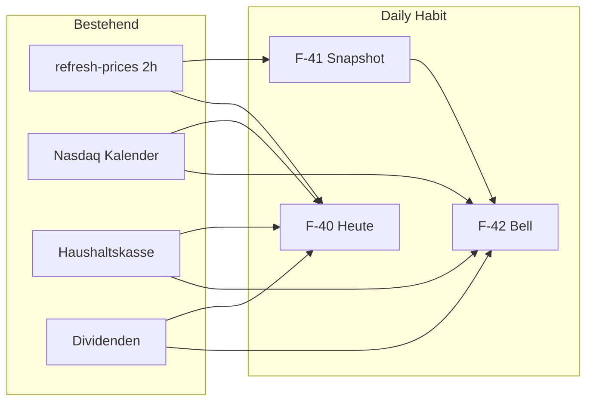

# Features

Feature-Backlog des Projekts. Architektur, Projektstand und Querverweise starten in [`README.md`](README.md).

Aktuell offen: **F-34**.
Erledigt: **F-31** One-Click-Install (2026-06-03). Daily-Habit **F-40**–**F-44** (2026-06-01). **F-45** Persönliches Einkommen (2026-06-02). **F-46** In-App-Update (2026-06-04).
Erledigte Features stehen im [`archive.md`](archive.md).

---

## Übersicht (offen)

| # | Bereich | Kurzbeschreibung | Status |
|---|---|---|---|
| F-31 | DevOps | One-Click-Installation unter Docker | ✅ erledigt 2026-06-03 |
| F-34 | Dashboard | Marktkalender-Abdeckung erweitern (DE/ETF, manuelle Termine) | 🟨 offen |
| F-40 | Dashboard | „Heute“-Briefing — kuratierte Tagesübersicht | ✅ erledigt 2026-06-01 |
| F-41 | Dashboard / Investments | Täglicher Vermögens-Snapshot | ✅ erledigt 2026-06-01 |
| F-42 | App | Notification Bell (Glocke + Inbox) | ✅ erledigt 2026-06-01 |
| F-43 | Haushaltskasse | Monatsroutine mit Partner-Status | ✅ erledigt 2026-06-01 |
| F-44 | Dashboard | „Dein Kalender“ — nur Depot-relevante Termine | ✅ erledigt 2026-06-01 |
| F-45 | App | Persönlicher Einkommen-Tab (`/einkommen`) — Brutto/Netto/Boni, HK-Sync, Jahresvergleich | ✅ erledigt 2026-06-02 |
| F-46 | DevOps / Einstellungen | Admin: Version anzeigen, Update mit Status-Log + Neustart-Countdown | ✅ erledigt 2026-06-04 |

**Priorisierung (Daily-Habit):** F-40 → F-41 → F-42 → F-43 → F-44

**Bewusst ausgeschlossen:** Expense-Tracking (Modul entfernt), Bank-Sync (widerspricht manuellem Modell), reine Watchlist ohne Depot-Bezug.



---

## F-31 — One-Click-Installation unter Docker

| | |
|---|---|
| **Bereich** | DevOps |
| **Status** | ✅ erledigt 2026-06-03 |

Ein Skript [`install.sh`](../install.sh) für Linux/LXC (Bootstrap via `curl | bash`) und optional [`install.ps1`](../install.ps1) für Windows/Docker Desktop: Voraussetzungen prüfen (Docker + Compose; auf Debian ggf. automatische Docker-Installation), Repository nach `/opt/financer` klonen, `.env` aus `.env.example` anlegen bzw. fehlende Secrets generieren, `NEXTAUTH_URL` interaktiv mit Vorschlag, `docker compose up -d --build`, Health-Wait, Erfolgsmeldung mit URL.

**One-Liner (frischer LXC):**

```bash
curl -fsSL https://raw.githubusercontent.com/carkeyuser/financer/main/install.sh | bash
```

**Ziel:** Frischer Server ohne manuelle README-Schritte. `docker-compose.yml` unverändert; `push.ps1` bleibt Update-Pfad für Entwickler.

---

## F-46 — Admin-Update unter Einstellungen

| | |
|---|---|
| **Bereich** | DevOps / Einstellungen |
| **Status** | ✅ erledigt 2026-06-04 |
| **Route** | `/settings` (OWNER + ADMIN) |
| **Aufwand** | mittel–hoch |

### Ziel

Self-hosted-Update ohne SSH/README: Admins sehen die **laufende App-Version** und starten ein **In-App-Update** mit nachvollziehbarem Fortschritt und kurzer Wartezeit bis der Stack wieder erreichbar ist.

### UI (`/settings`)

| Element | Verhalten |
|---------|-----------|
| Versionszeile | Aktuelle Version (z. B. aus `package.json` / Build-Metadaten / `GET /api/version`) |
| Button **„Update“** | Nur für Admin sichtbar; startet Update-Job |
| Status-Log | Scrollbares Panel (chronologisch): Schritte wie „Image pull …“, „Container neu erstellen …“, Fehler rot, Erfolg grün |
| Neustart-Phase | Nach erfolgreichem Deploy: Hinweis + **Countdown ~10 s** („Server startet neu …“), danach automatischer Reload oder Link „Jetzt öffnen“ |

Während des Updates: Buttons sperren, klare Meldung dass die App kurz nicht erreichbar sein kann.

### Backend / Deploy

- API z. B. `POST /api/admin/update` (Session + **Admin-Rolle**), optional `GET /api/admin/update/status` (SSE oder Polling)
- Serverseitig an bestehenden Pfad anbinden: [`scripts/update.sh`](../scripts/update.sh) bzw. Modus `build` / `ghcr` aus [`deploy.md`](deploy.md) (`FINANCER_DEPLOY_MODE`)
- Log-Zeilen aus Skript-Stdout/stderr an Client streamen; bei Fehler abbrechen, kein Countdown
- Sicherheit: nur Admin; Rate-Limit; kein beliebiges Shell — fest verdrahtete Update-Schritte

### Akzeptanzkriterien

- [x] Nicht-Admins sehen Version, aber keinen Update-Button
- [x] OWNER/ADMIN sieht Version + Update; Status-Log füllt sich während des Laufs
- [x] Erfolg: ~10 s Countdown, danach App wieder erreichbar (Health-Check oder manueller Reload)
- [x] Fehler: Log-Eintrag + keine falsche Erfolgs-Countdown-Phase
- [x] i18n de/en; Vitest für Auth-Gate und Status-Aggregation (Mock Update-Prozess)

**Umsetzung:** `UpdateCard`, `GET /api/version`, `POST /api/admin/update`, [`docker-compose.update.yml`](../docker-compose.update.yml), [`plan/deploy.md`](deploy.md).

---

## F-34 — Marktkalender-Abdeckung erweitern

| | |
|---|---|
| **Bereich** | Dashboard |
| **Status** | 🟨 offen |

Nasdaq liefert primär US-Symbole ohne Suffix (`.DE`, Krypto, Forex werden ignoriert). Self-hosted-Robustheit (`MARKET_CALENDAR_EXTERNAL`) ist umgesetzt (2026-05-27).

**Offen:** Alternative Quelle für DE/ETF, manuelle Termine oder Anbindung an Dividenden-Tab. Wird von **F-44** ergänzt (Depot-Filter); DE-Quelle bleibt hier oder in F-44 abgestimmt.

---

## F-40 — „Heute“-Briefing

| | |
|---|---|
| **Bereich** | Dashboard |
| **Status** | 🟨 offen |
| **Aufwand** | mittel |

### Ziel

Kuratierte Ansicht (Route `/heute` **oder** oberstes Dashboard-Widget), die in **~30 Sekunden** beantwortet: *Was hat sich verändert? Was steht an? Was ist offen?*

### Inhalt

| Block | Quelle / Umsetzung |
|-------|-------------------|
| Portfolio-Wert und G/V **seit gestern** bzw. seit letztem Besuch | Session-Timestamp + bestehende Berechnungen |
| Top 3 Beweger / Flops | [`TopFlopWidget`](../src/components/dashboard/TopFlopWidget.tsx) |
| Termine nächste 7 Tage **nur Depot-Ticker** | Marktkalender + Filter (siehe F-44 / F-34) |
| Haushaltskasse aktueller Monat | Status `leer` / `vorkalkuliert` / `fertig` aus [`household-finance.ts`](../src/lib/utils/household-finance.ts); fällige Überweisungen aus [`TransferPreviewSection`](../src/components/household-finance/TransferPreviewSection.tsx) |
| Dividenden | Nächste erwartete Zahlung / Summe Monat — [`DividendSummaryWidget`](../src/components/dashboard/DividendSummaryWidget.tsx) |

### API / Technik

- `GET /api/today` (oder `/api/dashboard/briefing`) — aggregiert bestehende Services; **kein** neues Kern-Datenmodell nötig
- i18n de/en
- Optional: Link von Dashboard-Header oder als Standard-Redirect nach Login (nach Update-Dialog / Portfolio-Snapshot)

### Akzeptanzkriterien

- [ ] Alle fünf Blöcke sichtbar; leere Blöcke mit sinnvollem Platzhalter
- [ ] „Seit letztem Besuch“ aktualisiert sich nach Session-Visit (Cookie/localStorage + Server optional)
- [ ] Mobile: lesbar ohne horizontales Scrollen
- [ ] Unit-Tests für Aggregations-Logik

---

## F-41 — Täglicher Vermögens-Snapshot

| | |
|---|---|
| **Bereich** | Dashboard / Investments |
| **Status** | 🟨 offen (Plan: 2026-06-02) |
| **Aufwand** | mittel |
| **Spezifikation** | [`feature-f41-portfolio-snapshot.md`](feature-f41-portfolio-snapshot.md) |

### Ziel

„**+€412 (+0,6 %) seit gestern**“ — Dopamin-Loop wie Broker-Apps, ohne neue Trades. Kurse kommen weiter von Yahoo (2h-Refresh).

### Datenmodell

```text
PortfolioDailySnapshot
  id, householdId, date (unique pro Haushalt+Tag)
  totalEur Decimal
  gainLossEur Decimal? (optional)
```

### Erzeugung

- Beim bestehenden [`POST /api/assets/refresh-prices`](../src/app/api/assets/refresh-prices/route.ts) **oder** nächtlicher Cron im Container: einmal pro Kalendertag Gesamtportfoliowert in EUR persistieren
- Berechnung: Summe über Haushalts-Assets (bestehende EUR-Logik aus Phase 7)

### UI

- Dashboard-Widget und/oder Zeile im F-40-Briefing
- Sparkline 30 / 90 Tage (Recharts, Muster [`PortfolioValueChart`](../src/components/investments/PortfolioValueChart.tsx))
- Optional Phase 2: Rekord-Hoch, längste Plus-Serie

### API

- `GET /api/portfolio/snapshots?days=90` — Zeitreihe für Charts und „seit gestern“

### Implementierungsplan (Kurz)

| # | Schritt | Abhängigkeit |
|---|---------|--------------|
| 1 | Prisma `PortfolioDailySnapshot` + Migration | — |
| 2 | Service `portfolio-snapshot.ts` (Laden wie `dashboard/summary`, Upsert, Serie) | 1 |
| 3 | Hook in `refresh-prices` → `upsertTodaySnapshot` | 2 |
| 4 | `GET /api/portfolio/snapshots?days=` | 2 |
| 5 | Widget `portfolio-delta` + Registry + Sparkline | 4 |
| 6 | Backup + i18n + Vitest | 1–4 |

**Hinweis:** `getPortfolioValueHistory()` bleibt für entry-basierte Charts; Snapshots sind **Marktwert-Zeitreihe** (tagesgenau).

### Akzeptanzkriterien

- [ ] Pro Haushalt max. ein Snapshot pro Tag; idempotent bei mehrfachem Refresh
- [ ] Widget zeigt Delta zu gestern; fehlender Vortag → „keine Vergleichsdaten“
- [ ] Tests für Snapshot-Upsert und Delta-Berechnung

---

## F-42 — Notification Bell (Glocke + Inbox)

| | |
|---|---|
| **Bereich** | App (Layout) |
| **Status** | 🟨 offen |
| **Aufwand** | mittel |
| **Abhängigkeiten** | Nutzt Daten aus Portfolio, Kalender, Haushaltskasse, Dividenden; ergänzt **F-43** später |

### Ziel

**Glocke** in Sidebar-Header und Mobile-Menü ([`Sidebar`](../src/components/layout/Sidebar.tsx), [`AuthGuard`](../src/components/layout/AuthGuard.tsx)) — Klick öffnet Inbox mit relevanten Hinweisen. **Kein** Push/E-Mail im MVP. Daily-Hook: **Badge sehen → öffnen → abarbeiten**.

### UI

| Element | Verhalten |
|---------|-----------|
| Bell-Icon (lucide `Bell`) | Neben Haushaltsbereich / Mobile-Header |
| Badge | Anzahl ungelesener (`9+` ab 10) |
| Panel | `Popover` (Desktop) / `Sheet` (Mobile); neueste zuerst |
| Eintrag | Icon nach Typ, Kurztitel, 1 Zeile Kontext, relatives Datum |
| Klick | Navigation zur Zielseite + als gelesen markieren |
| Footer | „Alle gelesen“ → Badge 0 |

**Beispiel-Einträge:**

- „ASML −6,2 % heute“ → `/investments/[id]`
- „Ex-Dividende MSFT in 2 Tagen“ → Position oder Dashboard
- „Haushaltskasse Juni noch leer“ → `/haushaltskasse`
- „Quartalsbonus Q2 in 5 Tagen“ → Haushaltskasse
- „Erwartete Dividende SAP am 15.06.“ → `/dividenden`

### Datenmodell

```text
Notification
  id, householdId
  userId String?          // null = alle im Haushalt
  type NotificationType
  titleKey, bodyKey       // i18n
  payload Json            // ticker, assetId, href, percent, …
  dedupeKey String?       // unique pro (householdId, dedupeKey) — Duplikate vermeiden
  createdAt, readAt
```

```text
enum NotificationType {
  PRICE_MOVE
  CALENDAR
  HOUSEHOLD_MONTH
  QUARTER_BONUS
  DIVIDEND_EXPECTED
  // Phase 2: HOUSEHOLD_PARTNER_PENDING (F-43)
}
```

### Regeln (MVP)

| Typ | Bedingung | Quelle |
|-----|-----------|--------|
| `PRICE_MOVE` | Position ±5 % (1 Tag) | Yahoo + Portfolio; Schwellwert Phase 2 konfigurierbar |
| `CALENDAR` | Ex-Div / Earnings in ≤7 Tagen für **Depot-Ticker** | Nasdaq + Portfolio |
| `HOUSEHOLD_MONTH` | Aktueller Monat `leer` ab Tag 5 | [`household-finance.ts`](../src/lib/utils/household-finance.ts) |
| `QUARTER_BONUS` | Bonus in ≤14 Tagen | Quartalslogik Haushaltskasse |
| `DIVIDEND_EXPECTED` | Erwartetes Datum in ≤7 Tagen | `DividendPayment` |

**Erzeugung:** Bei `refresh-prices` (Kursbewegungen); Kalender/Haushalt/Dividenden täglich oder on-demand beim Öffnen der Glocke. Max. eine Meldung pro `(type, entityId, calendarDay)` via `dedupeKey`.

### API

- `GET /api/notifications` — `{ items, unreadCount }`
- `PATCH /api/notifications/[id]` — `readAt`
- `POST /api/notifications/read-all`

### Komponenten

- `NotificationBell.tsx` — Bell + Badge + Panel
- `src/lib/services/notifications.ts` — Generator + Dedup

### Phase 2 (nicht MVP)

- Nutzer-Schwellen (±X %), Stummschaltung pro Typ
- Webhook ntfy / Gotify / SMTP

### Akzeptanzkriterien

- [ ] Bell + Badge in Sidebar und Mobile sichtbar
- [ ] Ungelesene werden gezählt; „Alle gelesen“ leert Badge
- [ ] Jeder Typ mindestens einmal testbar (Fixtures oder Seed)
- [ ] i18n de/en für Titel/Texte
- [ ] Keine doppelten Meldungen am selben Tag für dieselbe Entität

---

## F-43 — Haushaltskasse-Monatsroutine mit Partner-Status

| | |
|---|---|
| **Bereich** | Haushaltskasse |
| **Status** | 🟨 offen (Plan: 2026-06-02) |
| **Aufwand** | mittel |
| **Abhängigkeiten** | Reminder über **F-42** (`HOUSEHOLD_MONTH`; später `HOUSEHOLD_PARTNER_PENDING`) |
| **Spezifikation** | [`feature-f43-household-month-routine.md`](feature-f43-household-month-routine.md) |

### Ziel

Monat als **gemeinsames Ritual** für zwei Personen — nicht nur Tabelle. Koordinationspunkt für Paar/WG (Differenzierung zu reinen Depot-Apps).

### Flow

1. Checkliste pro Monat: Einkommen erfasst → Fixkosten → Auszahlungen → **Überweisungen erledigt**
2. Häkchen **pro User** (wer hat was erledigt)
3. Ampel im F-40-Briefing: „Juni: Partner A fertig, Partner B offen“
4. Ab Tag 5 bei `status === "leer"`: Eintrag in Notification Bell (F-42)
5. Quick-Link: Überweisungsbetrag aus `transfers` der Berechnung

### Datenmodell

Siehe Spezifikation — **`HouseholdMonthChecklist`** mit `@@unique([householdId, year, month, userId, step])` (keine Flags auf Income/Payout).

### Implementierungsplan (Kurz)

| # | Schritt | Abhängigkeit |
|---|---------|--------------|
| 1 | Prisma Enum + `HouseholdMonthChecklist` + Migration | — |
| 2 | `household-checklist.ts` — Aggregat/Ampel + Auto-Hints | 1 |
| 3 | `GET/PUT /api/household-finance/checklist` | 1–2 |
| 4 | `MonthRoutineCard` auf `/haushaltskasse` + Hook | 3 |
| 5 | Widget-Ampel / F-40-Hook vorbereiten | 2–4 |
| 6 | Backup + i18n + Vitest | 1–3 |
| 7 | F-42-Generator `HOUSEHOLD_MONTH` (ab Tag 5, `leer`) | **F-42** |

### UI

- Block auf [`/haushaltskasse`](../src/app/haushaltskasse/page.tsx) oberhalb oder neben der Tabelle
- Mobile: touch-freundliche Checkboxen

### Akzeptanzkriterien

- [ ] Beide User können unabhängig Häkchen setzen/entfernen
- [ ] Ampel-Status für Haushalt aggregiert sichtbar
- [ ] F-42 erhält Meldung bei offenem Monat (ab Tag 5)

---

## F-44 — „Dein Kalender“ (Depot-Termine)

| | |
|---|---|
| **Bereich** | Dashboard |
| **Status** | 🟨 offen |
| **Aufwand** | mittel–hoch |
| **Abhängigkeiten** | Baut auf **F-34** auf; speist **F-40** und **F-42** |

### Ziel

Marktkalender **nutzerzentriert**: nur Termine zu Tickern im Depot (+ optional Watchlist), nicht die generische Nasdaq-US-Liste.

### Features

- Filter: Events nur für Haushalts-`Asset.ticker`
- Countdown in UI: „Ex-Div ASML in 2 Tagen“ — auch in F-40-Briefing und F-42 (`CALENDAR`)
- Brücke Dividenden: erwartete vs. verbuchte Zahlung im Kalender-Kontext
- DE/ETF: manuelle Termine oder zweite Quelle (Überschneidung mit F-34 klären beim Implementieren)

### Akzeptanzkriterien

- [ ] Widget `market-calendar` zeigt standardmäßig gefilterte Events, wenn Portfolio nicht leer
- [ ] Leerer Zustand erklärt US-only-Limit oder verweist auf manuelle Termine
- [ ] F-42 und F-40 nutzen dieselbe gefilterte Event-Liste (shared Service)

---

## Kurzreferenz (Tabellenzeilen)

| # | Bereich | Beschreibung | Status |
|---|---|---|---|
| F-31 | DevOps | One-Click-Installation unter Docker (siehe oben) | ✅ erledigt 2026-06-03 |
| F-34 | Dashboard | Marktkalender DE/ETF, manuelle Termine (siehe oben) | 🟨 offen |
| F-40 | Dashboard | **Heute-Briefing:** Aggregation Portfolio, Top/Flop, Kalender, Haushalt, Dividenden; API `/api/today`; seit letztem Besuch | 🟨 offen |
| F-41 | Dashboard | **Vermögens-Snapshot:** `PortfolioDailySnapshot` täglich; Widget „seit gestern“ + Sparkline — [Spec](feature-f41-portfolio-snapshot.md) | 🟨 offen |
| F-42 | App | **Notification Bell:** Glocke, Badge, Inbox, `Notification`-Modell, Generator, API read/mark-all; kein Push MVP | 🟨 offen |
| F-43 | Haushaltskasse | **Monatsroutine:** Checkliste + Partner-Status + Bell-Reminder — [Spec](feature-f43-household-month-routine.md) | 🟨 offen |
| F-44 | Dashboard | **Dein Kalender:** nur Depot-Ticker; Countdown; Anbindung F-34 | 🟨 offen |
| F-46 | DevOps / Einstellungen | **Admin-Update:** Version in Settings, Update-Button, Status-Log, ~10 s Neustart-Countdown — siehe oben | ✅ erledigt 2026-06-04 |
